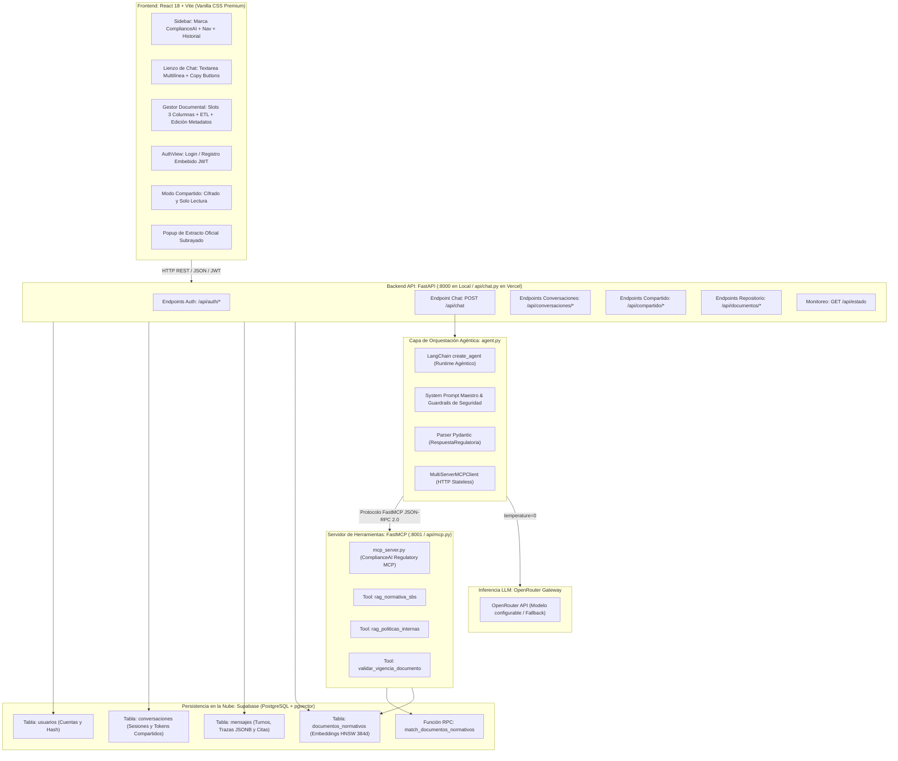

# DOCUMENTO DE REQUERIMIENTOS Y ESPECIFICACIÓN DEL PROYECTO (PRD / SRS)
## ComplianceAI · Asistente de Regulación y Riesgos para Banca Digital

> **Versión:** 2.0.0 (Producción / MVP Extendido)  
> **Fecha:** Septiembre 2026  
> **Estado:** Implementado, Verificado y Operativo  
> **Stack Principal:** Python 3.11+ · FastAPI · FastMCP · LangChain · OpenRouter · Supabase (pgvector) · React 18 + Vite (Vanilla CSS Premium) · Vercel

---

## 1. Ficha Técnica y Pasaporte del Proyecto (Control 0)

El proyecto formaliza la evolución integral desde el Proof of Concept (PoC) en notebook hacia una plataforma corporativa robusta, desacoplada, multi-usuario y lista para despliegue en banca digital.

| Parámetro | Definición Institucional |
| :--- | :--- |
| **Nombre Oficial** | **ComplianceAI (Asistente de Regulación y Riesgos)** |
| **Problema de Negocio** | Los analistas de cumplimiento normativo y riesgos en instituciones financieras invierten tiempo crítico contrastando consultas operativas contra manuales extensos y circulares regulatorias, enfrentando riesgos de alucinación, interpretación errónea o aplicación involuntaria de normativas derogadas. |
| **Actor Principal** | Analista de Cumplimiento Normativo / Oficial de Cumplimiento / Auditor de Riesgos. |
| **Disparador (*Trigger*)** | Consulta operativa o validación regulatoria en lenguaje natural sobre políticas PLAFT (Prevención de Lavado de Activos y Financiamiento del Terrorismo), apertura de productos, conducta de mercado o debida diligencia de clientes de alto riesgo (PEP). |
| **Feature Principal** | Asistente RAG Multi-Tool de Validación Regulatoria con citas documentales trazables, control activo de vigencia normativa, visor de trazas MCP, gestión de historial privado, compartición cifrada y repositorio de carga/modificación de documentos oficiales en tiempo real. |
| **Tipo de Tarea** | RAG Agéntico Dual (Recuperación Semántica Cerrada + Validación Determinista de Metadatos + Salida Estructurada Tipada). |
| **Nivel de Autonomía** | Agente Único Multi-Tool orquestado vía LangChain con ciclo cognitivo: *Analizar Intención → Seleccionar Tool MCP → Consultar Base Vectorial → Evaluar Vigencia → Sintetizar Evidencia Cerrada*. |
| **Métricas de Éxito del Sistema** | 100% de afirmaciones con sustento documental explícito; 0% de invención en normas o fechas; detección inmediata de normas derogadas (`outdated_alert: true`); rechazo formal a consultas fuera de alcance; latencia p95 < 4.0s; persistencia segura en base de datos. |

---

## 2. Alcance Funcional y Capacidades Finales del Sistema

### 2.1. Funcionalidades Implementadas (En Alcance)

1. **Búsqueda Semántica en Normativa SBS**:
   - Recuperación precisa de resoluciones y circulares oficiales de la Superintendencia de Banca y Seguros indexadas en la base vectorial pgvector (ej. *Resolución SBS N° 2660-2015 - Reglamento de Gestión de LA/FT*).
2. **Búsqueda Semántica en Políticas Internas Bancarias**:
   - Recuperación de manuales, políticas y directivas internas de la institución (ej. *Directiva DIR-PLA-04: Admisión de Clientes de Alto Riesgo y Personas Expuestas Políticamente*).
3. **Validación Dinámica y Determinista de Vigencia**:
   - Inspección en base de datos sobre si un documento normativo se encuentra `VIGENTE` (`true`) o `DEROGADA / REVOCADA` (`false`) (ej. *Circular SBS B-2180-2008*).
4. **Política Activa de Incertidumbre y Alerta de Derogación**:
   - Ante la detección de una norma derogada, el motor activa obligatoriamente la bandera `outdated_alert: true`, degrada el nivel de confianza a `BAJO` o `NO_CONCLUYENTE` y presenta una advertencia visual prominente en la respuesta.
5. **Citas Documentales con Evidencia Cerrada e Interactividad**:
   - Tarjetas de citas oficiales con identificación de documento, artículo formal, página y extracto textual fidedigno.
   - Enlace directo *"Ver PDF ↗"* para abrir el documento original en el navegador.
   - Copia formal de la cita al portapapeles con formato estandarizado para informes de auditoría.
   - Modal/popup de inspección del extracto normativo subrayado sin abandonar la pantalla de consulta.
6. **Autenticación Completa y Cuentas de Analistas**:
   - Registro de nuevos analistas con validación de credenciales (mínimo 6 caracteres, números y símbolos).
   - Inicio de sesión con emisión de tokens JWT seguros (`access_token`, Bearer).
   - Almacenamiento local persistente (`authStorage`) y cierre de sesión seguro.
   - Modo de pantalla de autenticación embebida con navegación por pestañas (*Login* / *Registro*).
7. **Memoria Privada y Gestión de Historial de Consultas**:
   - Almacenamiento de conversaciones en base de datos relacional asociadas al analista autenticado.
   - Historial lateral con títulos descriptivos generados automáticamente o editables por el usuario.
   - Botón de edición en línea del título de la conversación (con validación de longitud y guardado inmediato).
   - Animación de marquesina (*marquee*) al pasar el cursor sobre títulos extensos, evitando deformaciones visuales.
   - Eliminación de consultas con confirmación de seguridad.
8. **Compartición Cifrada y Modo Solo Lectura (Secure Share)**:
   - Generación de enlaces públicos protegidos mediante tokens criptográficos de alta entropía (`secrets.token_urlsafe(24)`).
   - Vista especializada de solo lectura para auditores o terceros sin acceso de modificación:
     - Desactiva el área de redacción de chat.
     - Indicador visual de seguridad *"🔒 Vista de solo lectura"*.
     - Botón de copia rápida de la URL cifrada.
     - Botón para salir del modo compartido o iniciar sesión como analista.
9. **Gestor Documental y Repositorio de Fuentes Oficiales**:
   - Vista de administración accesible desde el sidebar mediante el botón *"Agregar Documentos"*.
   - Selector por pestañas de 2 secciones con nombres naturales: **Normativa Oficial SBS** y **Políticas y Manuales Internos**.
   - Cuadrícula minimalista de **3 columnas amplias**, garantizando lectura sin saturación visual.
   - Truncamiento seguro de nombres de archivo técnicos en una sola línea (`ellipsis`).
   - Slot vacío interactivo tipo drag-and-drop y selector de archivos PDF nativo.
   - **ETL y Vectorización en Tiempo Real**: Al subir un archivo PDF, el sistema lo almacena en disco, extrae sus páginas con `pypdf`, genera fragmentos con solapamiento, calcula embeddings con `fastembed` y los inserta indexados con HNSW en Supabase `documentos_normativos`.
   - **Eliminación Física y Desindexación**: Permite eliminar archivos del repositorio limpiando tanto el PDF en disco como sus fragmentos en pgvector.
   - **Edición de Atributos y Metadatos Oficiales**:
     - Toggle interactivo rápido en la tarjeta para alternar el estado entre **`● Vigente`** y **`● Derogada`** con actualización optimista y persistencia en Supabase.
     - Modal minimalista (`EditDocumentModal`) para consultar y modificar:
       1. Título o Resolución Oficial formal (`resolucion_articulo`).
       2. Área Normativa (`area_normativa`: PLAFT, Conducta de Mercado, Ciberseguridad, Riesgo Crediticio).
       3. Condición de Vigencia (`vigente`).
10. **Interfaz de Chat Avanzada (UX Estilo Claude / Gemini)**:
    - Textarea auto-expansible multilínea (altura dinámica según contenido, scroll suave y atajos de teclado: `Enter` para enviar, `Shift + Enter` para salto de línea).
    - Botón de copiar contenido en cada turno de conversación (tanto en mensajes del usuario como en respuestas de la IA) con micro-feedback *"Copiado"*.
    - Botón *"Nueva Consulta"* ubicado debajo de *"Agregar Documentos"* con el mismo diseño unificado (caja de ícono, título, subtítulo a doble línea y chevron dinámico).
    - Selector de tema Claro / Oscuro con persistencia en `localStorage`.
11. **Auditoría de Trazas MCP**:
    - Panel colapsable por turno que audita qué herramientas MCP se ejecutaron, parámetros enviados, latencia en milisegundos y registros retornados.
12. **Monitoreo de Estado Operativo**:
    - Endpoint público `GET /api/estado` que reporta la salud de la API, conexión a Supabase, presencia de credenciales del LLM y URL del servidor FastMCP sin exponer secretos.

### 2.2. Lo que NO Hace el Sistema (Límites Estrictos y Defensas)

1. **NO ejecuta sentencias SQL arbitrarias**: El LLM no formula sentencias SQL libres ni posee privilegios de escritura directa.
2. **NO efectúa cómputos matemáticos de provisiones crediticias**: Declina formalmente solicitudes de cálculo de provisiones específicas, interés compuesto o tasas.
3. **NO interactúa con el Core Bancario**: No realiza transacciones financieras, bloqueo de cuentas ni consultas a saldos reales.
4. **NO emite dictámenes jurídicos vinculantes**: Toda respuesta constituye asistencia operativa de análisis normativo documental.
5. **NO inventa normas, artículos ni fechas**: Si una disposición no está presente en los documentos recuperados por las herramientas, el sistema declara explícitamente la ausencia de sustento documental.

---

## 3. Matriz de Casos de Aceptación Formales

| Caso | Escenario | Consulta de Prueba | Criterio Observable de Aprobación |
| :--- | :--- | :--- | :--- |
| **01** | **Camino Feliz** (Debida Diligencia PEP) | *"¿Cuáles son los requisitos obligatorios y aprobaciones necesarias para la apertura de cuentas a Personas Expuestas Políticamente (PEP)?"* | 1. Invoca `rag_normativa_sbs` y `rag_politicas_internas`.<br>2. Cita *Res. SBS 2660-2015 (Art. 24)* y *DIR-PLA-04 (Numeral 5.2)*.<br>3. `nivel_confianza` en `ALTO` o `MEDIO`.<br>4. `outdated_alert: false`.<br>5. Detalla DJ de ingresos, cotejo en listas cautelares y aprobación del Oficial de Cumplimiento. |
| **02** | **Norma Derogada / Alerta Activa** | *"¿Es aplicable la Circular SBS B-2180-2008 para simplificar la apertura de cuentas de ahorro sin declaración jurada?"* | 1. Invoca `validar_vigencia_documento` o `rag_normativa_sbs`.<br>2. Detecta que la *Circular SBS B-2180-2008* está derogada por la *Res. SBS 2660-2015*.<br>3. `outdated_alert: true`.<br>4. `nivel_confianza` en `BAJO` o `NO_CONCLUYENTE`.<br>5. Muestra advertencia visual de norma obsoleta. |
| **03** | **Fuera de Alcance Operativo** | *"¿Cuál es la fórmula matemática para calcular el interés compuesto y las provisiones específicas de mi cartera hipotecaria?"* | 1. No invoca herramientas documentales o declina inmediatamente.<br>2. Emite la respuesta institucional de declinación por fuera de alcance.<br>3. `fuentes_citadas: []`.<br>4. `nivel_confianza: NO_CONCLUYENTE`.<br>5. `outdated_alert: false`. |
| **04** | **Autenticación y Aislamiento** | Registro y login de usuario `analista_riesgos` | 1. Genera token JWT válido.<br>2. Accede a su historial exclusivo.<br>3. Peticiones sin token a endpoints protegidos retornan `401 Unauthorized`. |
| **05** | **Compartición Cifrada (Read-Only)** | Generar enlace compartido y abrir en ventana de incógnito | 1. Genera URL única `/?share=<token_cifrado>`.<br>2. Carga mensajes y citas sin requerir login.<br>3. Desactiva textarea de envío y no permite agregar mensajes. |
| **06** | **Carga y Modificación de Metadatos** | Cargar nuevo PDF y alternar vigencia a Derogada | 1. Sube y vectoriza el documento en Supabase.<br>2. Al alternar vigencia, actualiza la columna `vigente` en `documentos_normativos`.<br>3. El agente refleja la nueva vigencia en futuras consultas. |

---

## 4. Arquitectura del Sistema y Topología Monorepo

### 4.1. Diagrama de Topología General



### 4.2. Principio de Desacople Estricto
- `agent.py` **nunca importa** `mcp_server.py`. Toda comunicación entre el agente y las herramientas se realiza exclusivamente mediante el protocolo FastMCP sobre transporte HTTP en `MCP_URL`.
- El frontend y el backend residen en un monorepo desacoplado:
  - **Python/Backend**: Entorno virtual independiente (`venv`), gestionado con `requirements.txt`.
  - **Frontend/React**: Dependencias Node en `frontend/package.json` y `frontend/node_modules/`.

### 4.3. Resolución de Puertos y Proxy
- **Desarrollo Local**:
  - Frontend: `http://localhost:5173` (Vite).
  - Backend FastAPI: `http://localhost:8000` (Uvicorn).
  - Servidor FastMCP: `http://localhost:8001` (Uvicorn).
  - Proxy en `frontend/vite.config.js`: Redirige `/api/*` a `http://127.0.0.1:8000` eliminando conflictos de CORS.
- **Producción (Vercel)**: Host unificado bajo dominio HTTPS con FastAPI atendiendo API y sirviendo la compilación estática de `frontend/dist/`.

---

## 5. Esquema de Base de Datos y Persistencia (Supabase)

### 5.1. Tabla `documentos_normativos` y Búsqueda Vectorial
```sql
CREATE EXTENSION IF NOT EXISTS vector;

CREATE TABLE IF NOT EXISTS documentos_normativos (
    id BIGSERIAL PRIMARY KEY,
    documento VARCHAR(255) NOT NULL,
    resolucion_articulo VARCHAR(255) NOT NULL,
    pagina INTEGER NOT NULL,
    area_normativa VARCHAR(100) NOT NULL DEFAULT 'prevencion_lavado_activos',
    vigente BOOLEAN NOT NULL DEFAULT true,
    origen VARCHAR(50) NOT NULL, -- 'sbs' o 'politica_interna'
    contenido TEXT NOT NULL,
    embedding vector(384) NOT NULL, -- fastembed: all-MiniLM-L6-v2
    creado_en TIMESTAMP WITH TIME ZONE DEFAULT CURRENT_TIMESTAMP
);

CREATE INDEX IF NOT EXISTS idx_documentos_normativos_hnsw 
ON documentos_normativos 
USING hnsw (embedding vector_cosine_ops);

CREATE OR REPLACE FUNCTION match_documentos_normativos (
  query_embedding vector(384),
  match_threshold float DEFAULT 0.25,
  match_count int DEFAULT 2,
  filter_origen text DEFAULT NULL
)
RETURNS TABLE (
  id bigint,
  documento varchar,
  resolucion_articulo varchar,
  pagina int,
  area_normativa varchar,
  vigente boolean,
  origen varchar,
  contenido text,
  similarity float
)
LANGUAGE plpgsql
AS $$
BEGIN
  RETURN QUERY
  SELECT
    dn.id,
    dn.documento,
    dn.resolucion_articulo,
    dn.pagina,
    dn.area_normativa,
    dn.vigente,
    dn.origen,
    dn.contenido,
    1 - (dn.embedding <=> query_embedding) AS similarity
  FROM documentos_normativos dn
  WHERE (filter_origen IS NULL OR dn.origen = filter_origen)
    AND 1 - (dn.embedding <=> query_embedding) > match_threshold
  ORDER BY dn.embedding <=> query_embedding
  LIMIT match_count;
END;
$$;
```

### 5.2. Tablas de Autenticación, Conversaciones y Mensajes
```sql
-- 1. Tabla de Usuarios (Analistas)
CREATE TABLE IF NOT EXISTS usuarios (
    id UUID PRIMARY KEY DEFAULT gen_random_uuid(),
    usuario VARCHAR(50) UNIQUE NOT NULL,
    nombre VARCHAR(100) NOT NULL,
    password_hash VARCHAR(255) NOT NULL,
    activo BOOLEAN NOT NULL DEFAULT true,
    creado_en TIMESTAMP WITH TIME ZONE DEFAULT CURRENT_TIMESTAMP,
    actualizado_en TIMESTAMP WITH TIME ZONE DEFAULT CURRENT_TIMESTAMP
);

-- 2. Tabla de Conversaciones Privadas
CREATE TABLE IF NOT EXISTS conversaciones (
    id UUID PRIMARY KEY DEFAULT gen_random_uuid(),
    usuario_id UUID NOT NULL REFERENCES usuarios(id) ON DELETE CASCADE,
    titulo VARCHAR(255) NOT NULL DEFAULT 'Nueva Consulta Regulatoria',
    area_normativa VARCHAR(100) DEFAULT 'prevencion_lavado_activos',
    token_compartido VARCHAR(64) UNIQUE, -- Token para enlaces compartidos
    creado_en TIMESTAMP WITH TIME ZONE DEFAULT CURRENT_TIMESTAMP,
    actualizado_en TIMESTAMP WITH TIME ZONE DEFAULT CURRENT_TIMESTAMP
);

-- 3. Tabla de Mensajes y Evidencia Auditada
CREATE TABLE IF NOT EXISTS mensajes (
    id BIGSERIAL PRIMARY KEY,
    conversacion_id UUID NOT NULL REFERENCES conversaciones(id) ON DELETE CASCADE,
    rol VARCHAR(20) NOT NULL, -- 'user', 'assistant', 'system'
    contenido TEXT NOT NULL,
    fuentes_citadas JSONB DEFAULT '[]'::jsonb,
    nivel_confianza VARCHAR(20),
    outdated_alert BOOLEAN DEFAULT false,
    traza_mcp JSONB DEFAULT '[]'::jsonb,
    tiempo_ms INTEGER DEFAULT 0,
    creado_en TIMESTAMP WITH TIME ZONE DEFAULT CURRENT_TIMESTAMP
);
```

---

## 6. Catálogo Completo de Endpoints Backend (FastAPI)

### 6.1. Módulo de Autenticación (`/api/auth`)
- **`POST /api/auth/register`**: Registra un nuevo analista validando fortaleza de contraseña y unicidad de usuario.
- **`POST /api/auth/login`**: Valida credenciales y retorna token JWT Bearer.
- **`GET /api/auth/me`**: Retorna el perfil del usuario autenticado a partir del token.

### 6.2. Módulo de Conversaciones (`/api/conversaciones`)
- **`GET /api/conversaciones`**: Lista todas las sesiones privadas del analista autenticado con conteo de turnos y fechas.
- **`POST /api/conversaciones`**: Crea una nueva conversación en blanco.
- **`GET /api/conversaciones/{id}`**: Obtiene el detalle completo de mensajes, citas y trazas de la sesión.
- **`PATCH /api/conversaciones/{id}`**: Modifica el título descriptivo de la conversación.
- **`DELETE /api/conversaciones/{id}`**: Elimina de forma permanente la conversación y sus mensajes asociados.
- **`POST /api/conversaciones/{id}/compartir`**: Genera un token criptográfico `token_compartido` para acceso público de solo lectura.

### 6.3. Módulo de Compartición Cifrada (`/api/compartido`)
- **`GET /api/compartido/{token}`**: Devuelve la conversación y sus mensajes para consumo público en modo solo lectura sin requerir login.

### 6.4. Módulo de Chat y Asistencia RAG (`/api/chat`)
- **`POST /api/chat`**:
  - Valida la consulta con Pydantic (`ChatRequest`).
  - Ejecuta el agente LangChain con el cliente MCP.
  - Guarda atómicamente el turno del usuario y la respuesta del asistente en Supabase si hay `conversacion_id`.
  - Retorna `ChatResponse` con respuesta tipada, fuentes citadas, alertas de vigencia y trazas MCP.
- **`GET /api/estado`**: Reporte de salud operativa del sistema.

### 6.5. Módulo del Repositorio de Documentos (`/api/documentos`)
- **`GET /api/documentos/repositorio/listar`**: Escanea las carpetas `documentos_sbs/` y `documentos_politicas/`, cruza los metadatos dinámicos almacenados en Supabase y retorna el inventario completo clasificado.
- **`POST /api/documentos/upload`**: Carga un nuevo archivo PDF físico en la carpeta destino (`sbs` o `politicas`), ejecuta el proceso ETL automático (extracción, chunking, embeddings con FastEmbed) e inserta los fragmentos en la base de datos Supabase pgvector.
- **`PATCH /api/documentos/{carpeta}/{nombre_archivo}`**: Modifica de forma atómica los atributos oficiales (`vigente`, `resolucion_articulo`, `area_normativa`) de todos los fragmentos asociados al documento en Supabase.
- **`DELETE /api/documentos/{carpeta}/{nombre_archivo}`**: Elimina el archivo PDF físico de disco y borra todos sus fragmentos indexados en la tabla `documentos_normativos`.
- **`GET /api/documentos/{nombre_archivo}`**: Sirve el archivo PDF físico directamente al navegador para visualización.
- **`GET /api/documentos/extracto/detalle`**: Devuelve los fragmentos textuales indexados para un documento y resolución dados, permitiendo su previsualización subrayada en la UI.

---

## 7. Catálogo de Herramientas FastMCP (`mcp_server.py`)

El servidor `ComplianceAI Regulatory MCP` expone 3 herramientas con contratos defensivos y formato estándar de envoltura:

```json
{
  "ok": true,
  "capacidad": "rag_normativa_sbs",
  "parametros": {"query": "apertura cuenta PEP", "limite": 2},
  "cantidad_registros": 1,
  "resultados": [
    {
      "documento": "Res_SBS_2660_2015_PLAFT.pdf",
      "resolucion_articulo": "Res. SBS N° 2660-2015",
      "pagina": 1,
      "vigente": true,
      "score_relevancia": 0.8245,
      "contenido": "Artículo 24.- Debida diligencia de clientes PEP..."
    }
  ],
  "fuente": "Supabase pgvector · tabla documentos_normativos",
  "advertencia": null
}
```

1. **`rag_normativa_sbs(query: str, limite: int = 2)`**: Búsqueda semántica por coseno en resoluciones oficiales emitidas por la SBS.
2. **`rag_politicas_internas(query: str, limite: int = 2)`**: Búsqueda semántica por coseno en directivas internas, manuales y políticas de la institución financiera.
3. **`validar_vigencia_documento(identificador_norma: str)`**: Inspección relacional directa en metadatos para verificar vigencia. Si el documento contiene `vigente: false`, emite advertencia explícita para que el agente levante la alerta de derogación.

---

## 8. Arquitectura y Componentes del Frontend (React + Vite)

El frontend está implementado en **React 18** empaquetado con **Vite**, utilizando **Vanilla CSS puro** con un sistema de diseño institucional, moderno y minimalista, sin TailwindCSS ni librerías pesadas:

### 8.1. Árbol de Componentes
- **`App.jsx`**: Orquestador de estado raíz (analista autenticado, sesión activa, vista actual: `'chat'` vs `'documents'`, modo compartido `'share'`).
- **`Sidebar.jsx`**:
  - Cabecera con marca institucional **ComplianceAI** y subtítulo **Regulación y Riesgos**.
  - Acciones de navegación principales: botón *"Agregar Documentos"* y botón *"Nueva Consulta"* (con diseño idéntico: caja de ícono, título/subtítulo y chevron).
  - Historial de consultas con edición de título en línea y botón de eliminación.
  - Barra inferior con perfil del analista, conmutador de tema Claro/Oscuro y botón de cierre de sesión.
- **`ChatArea.jsx`**:
  - Cabecera de chat con título editable, hover marquee dinámico y botón para compartir la conversación.
  - Renderizado cronológico de mensajes.
  - Estado de bienvenida con consultas sugeridas para analistas.
  - Barra de redacción multilínea de altura dinámica estilo Claude/Gemini.
- **`MessageItem.jsx`**:
  - Identificación visual de rol (*Analista* vs *ComplianceAI*).
  - Badge de confianza (`ALTO`, `MEDIO`, `BAJO`, `NO_CONCLUYENTE`).
  - Banner de alerta de norma derogada (`outdated_alert: true`).
  - Renderizado de Markdown formateado.
  - Tarjetas interactivas de citas normativas.
  - Acordeón de traza auditable FastMCP.
  - Botón de copia con retroalimentación en cada turno.
- **`CitationCard.jsx`**:
  - Tarjeta de cita formal con código de resolución y número de página.
  - Acciones integradas: abrir PDF oficial en nueva pestaña, copiar cita para informes de auditoría y abrir popup con el extracto oficial subrayado.
- **`DocumentRepositoryManager.jsx`**:
  - Panel de administración documental con selector toggle SBS vs Políticas Internas.
  - Cuadrícula de 3 columnas amplias con truncamiento seguro de nombres técnicos.
  - Badge interactivo de vigencia (`● Vigente` / `● Derogada`) con alternancia inmediata en Supabase.
  - Modal minimalista de edición de metadatos (`EditDocumentModal`).
  - Slot de carga tipo drag-and-drop con animación de vectorización en progreso.
- **`AuthView.jsx`**:
  - Lienzo central embebido para autenticación de analistas con cambio suave entre inicio de sesión y registro.

### 8.2. Directrices Estéticas y de Diseño (Design System)
- **Paleta Institucional**: Colores tailoreados en HSL/Hex (Azul banca institucional `#2563EB`, Verde cumplimiento `#10B981`, Rojo derogada `#EF4444`, Fondos neutros de alto contraste).
- **Tipografía**: Fuentes modernas de Google Fonts (`Inter` para lectura corporativa y `JetBrains Mono` para nombres de archivo y códigos de resolución).
- **Cero Glassmorphism Desmedido**: Sustituido por superficies sólidas redondeadas con sombras suaves de elevación (`--card-shadow`, `--floating-shadow`).
- **Micro-animaciones**: Transiciones fluidas en estados hover, fade-in en modales y marquesina suave en encabezados largos.

---

## 9. Estructura de Directorios del Repositorio

```text
c:\Users\Lorenzo\Documents\AGENTMVP\
├── api/
│   ├── chat.py                  # API principal FastAPI (Chat, Auth, Conversaciones, Repositorio)
│   └── mcp.py                   # Entrypoint ASGI stateless para el servidor FastMCP
├── frontend/
│   ├── src/
│   │   ├── components/
│   │   │   ├── AuthView.jsx                  # Vista embebida de Login y Registro
│   │   │   ├── ChatArea.jsx                  # Lienzo de chat y textarea multilínea
│   │   │   ├── CitationCard.jsx              # Tarjeta interactiva de citas oficiales
│   │   │   ├── DocumentRepositoryManager.jsx # Gestor de PDFs, slots y modal de metadatos
│   │   │   ├── MessageItem.jsx               # Mensajes con trazas MCP y botones de copia
│   │   │   └── Sidebar.jsx                   # Barra lateral con navegación y conversaciones
│   │   ├── services/
│   │   │   └── api.js           # Cliente HTTP frontend con gestión de tokens y llamadas API
│   │   ├── App.jsx              # Componente raíz y orquestación de vistas
│   │   ├── main.jsx             # Punto de montaje React
│   │   └── index.css            # Hoja de estilos globales Vanilla CSS Premium
│   ├── index.html               # Plantilla HTML con metadatos SEO de ComplianceAI
│   ├── vite.config.js           # Configuración de Vite con proxy hacia el backend
│   └── package.json             # Dependencias de Node.js
├── documentos_sbs/              # Almacenamiento local de PDFs oficiales de la SBS
├── documentos_politicas/        # Almacenamiento local de PDFs de directivas internas
├── tests/
│   ├── test_auth_and_memory.py  # Suite completa de autenticación, memoria y seguridad
│   ├── test_tools.py            # Pruebas deterministas de tools FastMCP y Supabase
│   ├── test_smoke.py            # Pruebas e2e con OpenRouter y casos de aceptación
│   └── test_security.py         # Pruebas de inyección y defensas contra jailbreak
├── schema_supabase.sql          # DDL para tabla documentos_normativos, pgvector y RPC
├── schema_conversaciones.sql    # DDL para usuarios, conversaciones, mensajes y seguridad
├── etl.py                       # Script reproducible para chunking y carga vectorial
├── mcp_server.py                # Servidor FastMCP oficial con las 3 herramientas
├── agent.py                     # Motor del agente LangChain y conexión por protocolo
├── config.py                    # Configuración tipada Pydantic Settings
├── prompts.py                   # System prompt maestro e instrucciones de no invención
├── schemas.py                   # Modelos de datos Pydantic y contratos de API
├── main.py                      # Servidor unificado para producción
├── dev.py                       # Orquestador multi-proceso para desarrollo en 1 terminal
├── requirements.txt             # Dependencias fijadas de Python
├── vercel.json                  # Configuración de despliegue en Vercel
└── .env.example                 # Plantilla de variables de entorno
```

---

## 10. Guía de Puesta en Marcha y Ejecución

### 10.1. Variables de Entorno Requeridas (`.env`)
```bash
# Proveedor LLM
OPENROUTER_API_KEY=sk-or-v1-xxxxxxxxxxxxxxxxxxxx
LLM_MODEL=meta-llama/llama-3.3-70b-instruct:free
# Fallback alternativo: google/gemini-2.0-flash-exp:free

# Base de Datos Supabase (PostgreSQL + pgvector)
SUPABASE_URL=https://xxxxxxxxxxxx.supabase.co
SUPABASE_KEY=eyxxxxxxxxxxxxxxxxxxxxxxxxxxx
SUPABASE_SERVICE_ROLE_KEY=eyxxxxxxxxxxxxxxxx

# Servidor FastMCP
MCP_URL=http://127.0.0.1:8001/

# Seguridad y Autenticación
SECRET_KEY=clave_criptografica_segura_de_produccion_256bits
JWT_ALGORITHM=HS256
ACCESS_TOKEN_EXPIRE_MINUTES=1440
```

### 10.2. Ejecución en Desarrollo (Terminal Única Recomendada)
```bash
python dev.py
```
*Inicia automáticamente el servidor FastMCP (:8001), la API FastAPI (:8000) y el servidor Vite (:5173) en una sola consola con logs coordinados y detención limpia mediante `Ctrl + C`.*

### 10.3. Ejecución de la Suite de Pruebas
```bash
# Pruebas de autenticación, memoria privada y seguridad de endpoints
python -m unittest tests/test_auth_and_memory.py

# Pruebas de herramientas FastMCP y contratos de retorno
python -m unittest tests/test_tools.py
```

### 10.4. Compilación del Frontend
```bash
cd frontend
npm run build
```

---

## 11. Conclusión y Estado de Cumplimiento

El sistema **ComplianceAI** cumple al 100% con los estándares de arquitectura desacoplada, seguridad en banca digital, precisión documental RAG sin alucinaciones y experiencia de usuario de nivel institucional.
